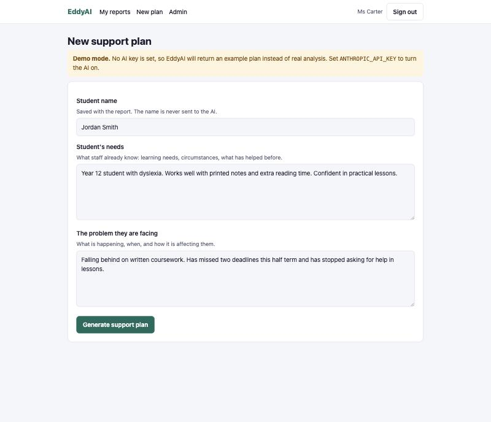
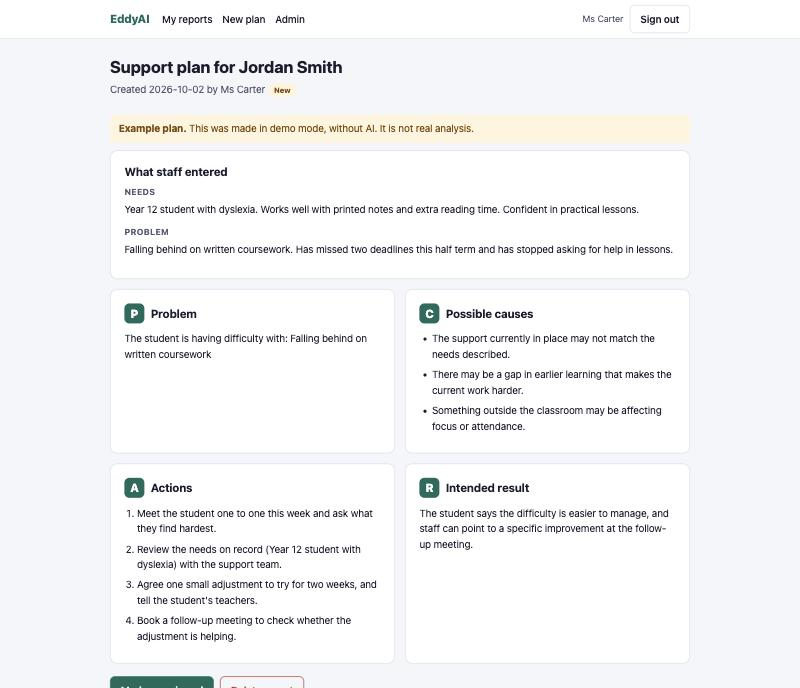

# EddyAI

[](https://github.com/Mubarakjk/eddy-ai/actions/workflows/ci.yml)

An AI-powered student support app. A teacher enters a student's name, the student's needs and the problem they are facing, and EddyAI drafts a personalised support plan using the PCAR framework: **Problem, Cause, Action, Result**.

| 1. The teacher fills in three fields | 2. EddyAI returns a structured plan |
| --- | --- |
|  |  |

> This is a rebuild of a project I first built at Pilot Generative AI. I wrote this version from scratch as a personal project. It contains no company code or data.

## What it does

Support staff often know a student is struggling but have to turn that into a plan from a blank page. EddyAI gives them a structured first draft in seconds, which they then check and adjust using what they know about the student.

Every plan has the same four parts:

| Step | What EddyAI writes |
| --- | --- |
| **Problem** | A clear statement of the difficulty, without blame |
| **Cause** | Possible causes for staff to look into |
| **Action** | Practical steps staff can take this week |
| **Result** | The intended outcome, so staff can tell whether it worked |

## Features

- **PCAR support plans** generated by Claude from the needs and problem staff enter
- **Secure login** with hashed passwords
- **Saved reports** that staff can return to, print or delete
- **Admin dashboard** where authorised staff see every report, filter by status and mark reports as reviewed
- **Two roles**: staff see only their own reports, admins see everything
- **Demo mode**: runs without an API key, using a clearly labelled example plan, so anyone can try it

## How it works

```
Browser ──▶ Flask routes ──▶ pcar.py ──▶ Claude API
                │                │
                ▼                ▼
             SQLite      SupportPlan (validated)
```

1. A teacher signs in and fills in three fields: the student's name, the student's needs and the problem.
2. `reports.py` validates the input and passes it to `pcar.generate_plan`.
3. `pcar.py` sends it to Claude with a system prompt that explains PCAR and sets the rules.
4. Claude's answer comes back as a `SupportPlan` object with four fields, already checked against the schema.
5. The plan is saved to SQLite and shown as four cards.

### Getting structured output from the AI

The hardest part of an app like this is making the AI answer in the same shape every time. Free text that says "Problem: ..." somewhere in a paragraph cannot be saved or displayed reliably.

EddyAI defines the shape as a Pydantic model and hands it to the API:

```python
class SupportPlan(BaseModel):
    problem: str
    causes: list[str]
    actions: list[str]
    result: str


response = client.messages.parse(
    model="claude-opus-5-5",
    system=SYSTEM_PROMPT,
    messages=[...],
    output_format=SupportPlan,
)
plan = response.parsed_output
```

The API is then constrained to return exactly those four fields, so there is no fragile text parsing.

### Keeping the AI in its lane

This app is about real students, so the system prompt sets firm rules. The AI must:

- treat causes as possibilities to look into, not conclusions
- never diagnose a medical condition, learning difficulty or mental health condition
- put the safeguarding procedure first if the description suggests a student is at risk
- say what to find out when information is missing, instead of assuming

Every AI plan is shown with a notice that it is a draft for staff to check.

## Security

| Risk | What EddyAI does |
| --- | --- |
| Stolen passwords | Passwords are hashed with scrypt and never stored as typed |
| Seeing someone else's report | Every report lookup checks the owner. Another user's report returns the same 404 as one that does not exist |
| Signing up as an admin | The sign-up page always creates staff. Admins are created from the command line |
| Cross-site request forgery | Every form carries a per-session token that is checked on every POST |
| SQL injection | All queries use parameters. Nothing from the user is pasted into SQL |
| Cross-site scripting | Templates escape everything by default, backed by a Content Security Policy |
| Prompt injection | Staff input is wrapped in tags and sent apart from the instructions, and the AI is told to treat it as a description, not a command |
| Guessing which emails have accounts | Login gives one message for a wrong email or a wrong password, and takes the same time for both |
| Stale access | The user's role is read from the database on every request, so a removed account loses access straight away |
| Student privacy | The student's name is saved with the report but never sent to the AI. Only the needs and the problem are. Signed-in pages are never cached by the browser |

## Run it

You need Python 3.10 or newer.

```bash
git clone https://github.com/Mubarakjk/eddy-ai.git
cd eddy-ai
python3 -m venv .venv
source .venv/bin/activate
pip install -r requirements.txt
flask --app eddy run
```

Open http://127.0.0.1:5000 and create a staff account. With no API key set, EddyAI runs in demo mode.

To turn the AI on, set your Anthropic API key before starting the app:

```bash
export ANTHROPIC_API_KEY=your-key-here
```

To create an admin account:

```bash
flask --app eddy create-admin
```

## Project structure

```
eddy/
  __init__.py    App factory and configuration
  auth.py        Sign up, sign in, sign out
  security.py    Login and admin checks, CSRF protection, security headers
  pcar.py        The PCAR prompt, the SupportPlan schema and the Claude call
  reports.py     Create, list, view and delete support plans
  admin.py       Admin dashboard
  db.py          SQLite schema and the create-admin command
  templates/     Jinja templates
  static/        Stylesheet
tests/           37 tests
```

## Tests

```bash
pip install -r requirements-dev.txt
pytest
ruff check .
```

The tests cover the login flow, every access rule (staff against staff, staff against admin), CSRF rejection, input validation and each way the AI call can fail. The AI is replaced with a stand-in during tests, so they are fast, free and never send data anywhere.

GitHub Actions runs the tests and linter on every push.

## Limits and next steps

- A plan is a starting point. It does not replace the judgement of staff who know the student.
- SQLite suits one organisation on one server. A larger deployment would move to PostgreSQL.
- Next I would add editing a plan after it is generated, a follow-up date on each plan, and login rate limiting.

## Tech

Python, Flask, SQLite, Pydantic, the Anthropic API (Claude), pytest, Ruff and GitHub Actions.

## License

[MIT](LICENSE)
